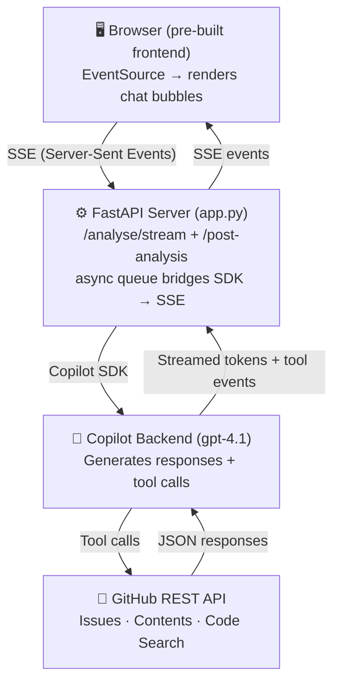

# 🐛 GitHub Issue Complexity Analyser

> **Livestream Demo**: Building an AI-powered issue triage tool with the GitHub Copilot SDK

An intelligent issue triage tool that analyses GitHub issues in context - fetching issue details, exploring repository structure, reading source code - and produces a structured complexity assessment recommending the appropriate developer skill level for the fix.

Built during a **60-minute livestream** to demonstrate the GitHub Copilot SDK's capabilities.

> **📌 Using this repo:** This is a learning tool for the GitHub Copilot SDK.
> - **Doing the activity?** Follow [`step-by-step/build-guide.md`](step-by-step/build-guide.md) and fill in [`app.py`](app.py).
> - **Just want to see it working?** Look at [`app_final.py`](app_final.py).
> - **Presenting this yourself?** Start with [`presenter-resources/`](presenter-resources/) (includes a [`pre-stream-check.sh`](presenter-resources/pre-stream-check.sh) script).

---

## 🚀 Quick Start

Pick one of the three setup options below. Click to expand.

<details>
<summary><h3 style="display:inline">🌐 Option 1: GitHub Codespaces (recommended for the stream)</h3></summary>

The easiest way to get started — everything is pre-configured in the devcontainer.

1. Click **Code** → **Codespaces** → **Create codespace on main**
2. When prompted, enter your **GitHub personal access token** (the Codespace will ask for it automatically)
3. Wait for the setup to finish — Python, dependencies, and the Copilot SDK are all installed for you
4. You're ready to go!

</details>

<details>
<summary><h3 style="display:inline">🐳 Option 2: Local Dev Container</h3></summary>

For a Codespaces-like experience locally with full isolation:

1. Install [Docker Desktop](https://www.docker.com/products/docker-desktop)
2. Install the [Dev Containers](https://marketplace.visualstudio.com/items?itemName=ms-vscode-remote.remote-containers) extension in VS Code
3. Open this folder in VS Code → click "Reopen in Container" (bottom-left)
4. VS Code builds the container from `docker-compose.yml` and automatically:
   - Loads your `.env` file with `GITHUB_TOKEN`
   - Installs Python and dependencies
5. You're ready to go!

<details>
<summary><b>New to Dev Containers?</b> Click to expand.</summary>

Dev Containers let you develop inside a Docker container as if it were your local machine. All your tools, dependencies, and environment variables are isolated and reproducible.

- **[Dev Containers Documentation](https://containers.dev/)** — Official spec and guides
- **[VS Code Remote Development](https://code.visualstudio.com/docs/remote/remote-overview)** — How to use with VS Code
- **Benefits**: Consistent environments across team, no "works on my machine" problems, easy onboarding

For this project, you don't need to understand Docker internals—just think of it as "VS Code in a sandboxed environment that has everything pre-installed."

</details>

</details>

<details>
<summary><h3 style="display:inline">🐍 Option 3: Local Python (No Container)</h3></summary>

For a quick local setup without containerization:

Prerequisites:
- **Python 3.10+**
- **[uv](https://docs.astral.sh/uv/)** (Python package manager)
- **GitHub Token** — needed for API access and Copilot SDK auth

#### Setup

```bash
# Clone the repository
git clone https://github.com/reneenoble/copilot-sdk-github-issue-analyser-.git
cd copilot-sdk-github-issue-analyser-

# Create .env file with your GitHub token
cp .env.example .env
# Then edit .env and add your token:
#   GITHUB_TOKEN=ghp_your_token_here

# Install dependencies
uv sync

# Alternatively, export the token in your shell
export GITHUB_TOKEN=ghp_your_token_here
```

</details>

### 🪙 Getting a GitHub Token

All three options require a GitHub personal access token. Create one with the correct permissions:


<details>
<summary>Click to expand step-by-step token instructions</summary>


1. Go to **github.com** → your profile picture (top right) → **Settings**
2. Scroll down left sidebar → **Developer settings** → **Personal access tokens** → **Fine-grained tokens**
3. Click **Generate new token**
   - Name: `copilot-sdk-stream` (or similar)
   - Expiration: 7 days (sufficient for a demo)
   - Repository access: **All repositories**
   - Permissions:
     - **Issues**: Read and Write
     - **Contents**: Read
4. Click **Generate token** and copy it
5. Add to `.env`: `GITHUB_TOKEN=ghp_...` (or export as shown above)

</details>

## Running the Project

### 💻 Running the final product (from terminal)

This project makes a several different functions you can run from the terminal. 

```bash
# Test the SDK (Phase 2a: simplest call)
python app.py hello

# Test with streaming (Phase 2b)
python app.py hello-stream

# Analyse an issue by URL
python app.py https://github.com/reneenoble/demo_project_with_issues/issues/3

# Analyse by owner/repo/number
python app.py reneenoble demo_project_with_issues 3

# Start the web UI (click "Post to GitHub" in the UI to write back)
python app.py serve
```

---

### ▶️ Running from VS Code (Run & Debug)

We've added some quick helpers to run your server for both the project file (app.py) and the final code (app_final.py). 

This repo ships with VS Code launch configurations in [`.vscode/launch.json`](.vscode/launch.json) so you don't have to remember terminal commands. Open the **Run and Debug** view (⇧⌘D / Ctrl+Shift+D) and pick one from the dropdown:

| Launch config | Runs | Port | When to use |
|---|---|---|---|
| **Run Webapp Server** | `app.py serve` | `http://localhost:8000` | Run the code **you** are building during the livestream |
| **Run Webapp Server (final)** | `app_final.py serve` | `http://localhost:8001` | Run the completed reference implementation |

The project code and final code run on different ports by default so you don't get any conflicts. 


## In this Project
### What is the Copilot SDK?

| Copilot in your editor | Copilot SDK |
|------------------------|-------------|
| Built into VS Code, JetBrains, etc. | A Python / JS / C# library you install |
| Suggests code while you type | Your application calls it like any other library |
| You see the results on screen | Your code receives the results and decides what to do |
| A tool for developers | A building block for applications |

**The SDK lets you embed Copilot into your own applications.** You define what it can do. Your code stays in control.

---

### Copilot SDK Concepts Demonstrated

The three building blocks of the SDK — and how this project uses them:

- **`CopilotClient`** — connects to the Copilot backend and manages session lifecycle
- **Session** — a conversation thread where you set the model, tools, and instructions
- **`@define_tool`** — your own Python functions, with Pydantic parameter schemas, that the model can call
- **Agentic tool calling** — Copilot autonomously decides which tools to call and in what order
- **Streaming event handling** — real-time processing of `assistant.message`, `tool.call`, and `session.idle` events
- **Multi-turn tool loops** — the agent makes multiple rounds of tool calls before producing its final assessment

---

### 🏗️ Architecture



---

### Troubleshooting

- **"GITHUB_TOKEN not found"** → Check `.env` file or `export GITHUB_TOKEN=...`
- **"Rate limit exceeded"** → Your token isn't being read; verify `GITHUB_TOKEN` is set
- **"Model not available"** → Verify you have Copilot access; check with `copilot --version`
- **Browser won't connect to SSE** → Try `http://127.0.0.1:8000` instead of `localhost`

---

## 📚 Learning Resources & Links

| Resource | Description |
|----------|-------------|
| 📖 [Official SDK Documentation](https://github.com/github/copilot-sdk) | GitHub Copilot SDK repo and docs |
| 🎓 [Copilot SDK for Beginners Course](https://github.com/reneenoble/github-copilot-sdk-for-beginners) | A hands-on course teaching you to build AI agents with the SDK |
| � [Copilot Plans & Pricing](https://github.com/features/copilot/plans) | Includes a free tier |


---

## ⚖️ Responsible AI Notes

See [docs/RAI.md](docs/RAI.md) for full details. Key points:

- **Not a replacement for human judgement** - the assessment is a starting point for triage discussions
- **Skill level labels are contextual** - "Junior" and "Senior" refer to familiarity with the specific codebase
- **No personal data processing** - only reads public GitHub issue data and repository content
- **Full transparency** - every tool call is visible so users can see exactly what the agent examined

---

## 📄 License

MIT - see [LICENSE](LICENSE) for details.
